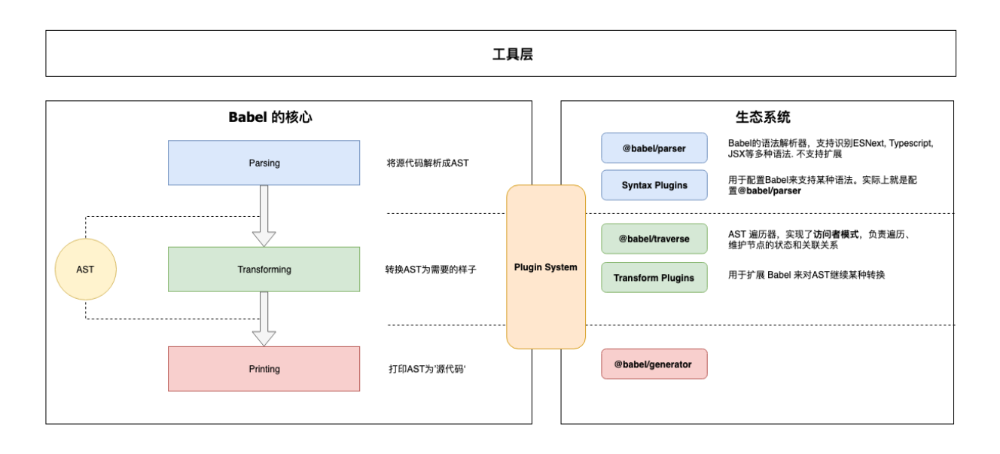

`JS 编译器` `AST` `插件系统`

Babel 是 JavaScript 编译器：他能让开发者在开发过程中，直接使用各类方言（如 TS、Flow、JSX）或新的语法特性，而不需要考虑运行环境，因为 Babel 可以做到按需转换为低版本支持的代码；Babel 内部原理是将 JS 代码转换为 AST，对 AST 应用各种插件进行处理，最终输出编译后的 JS 代码。

原文：<https://bobi.ink/2019/10/01/babel/>

- 核心 `@babel/core`
  - 加载和处理配置
  - 加载插件
  - 调用Parser进行语法解析，生成AST
  - 调用 Traverser 遍历AST，并使用访问者模式应用’插件’对 AST 进行转换
  - 生成代码，包括SourceMap转换和源代码生成

- Parser(@babel/parser)： 将源代码解析为 AST 就靠它了。 它已经内置支持很多语法. 例如 JSX、Typescript、Flow、以及最新的ECMAScript规范。目前为了执行效率，parser是不支持扩展的，由官方进行维护。如果你要支持自定义语法，可以 fork 它，不过这种场景非常少。

- Traverser(@babel/traverse)： 实现了`访问者模式`，对 AST 进行遍历，转换插件会通过它获取感兴趣的AST节点，对节点继续操作

- Generator(@babel/generator)： 将 AST 转换为源代码，支持 SourceMap

### 访问者模式

由这个访问者(Visitor)来 ① 进行统一的遍历操作，② 提供节点的操作方法，③ 响应式维护节点之间的关系；而插件(设计模式中称为‘具体访问者’)只需要定义自己感兴趣的节点类型，当访问者访问到对应节点时，就调用插件的访问(visit)方法。
访问者会以`深度优先`的顺序, 或者说`递归`地对 AST 进行遍历

Babel 会按照插件定义的顺序来应用访问方法
