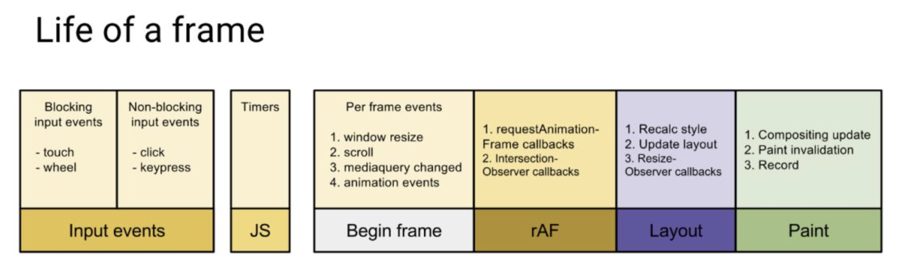

参考地址
https://react.iamkasong.com/

(React关键核心fiber是什么)[https://blog.csdn.net/leelxp/article/details/108055446?spm=1001.2014.3001.5502]

## React概念

### [React 组件，元素和实例](https://zh-hans.reactjs.org/blog/2015/12/18/react-components-elements-and-instances.html)

- **元素** - 一个*元素*一个用来描述组件实例或 DOM 节点及其需要属性的普通对象，它只是一个携有 type: (string | ReactClass) 和 props: Object1 字段的不可变描述对象。
```js
{
  type: 'button',
  props: {
    className: 'button button-blue',
    children: {
      type: 'b',
      props: {
        children: 'OK!'
      }
    }
  }
}
```

- **组件** - 一个*组件*可以通过多种不同的方式声明。它可以是一个带有 `render()` 方法的类。或者，更简单些，它可以被定义成一个函数。不论何种方式，它都需要 props 作为输入，返回一个 element tree 作为输出。
- **实例** - this，[保存本地状态和响应生命周期事件](https://zh-hans.reactjs.org/docs/component-api.html) 函数组件根本没有实例

### [stack reconciler](https://zh-hans.reactjs.org/docs/codebase-overview.html#stack-reconciler) 
[React实现说明](https://zh-hans.reactjs.org/docs/implementation-notes.html)

### React15架构

- Reconciler（协调器）—— 负责找出变化的组件
- Renderer（渲染器）—— 负责将变化的组件渲染到页面上

### React16架构

- Scheduler（调度器）—— 调度任务的优先级，高优任务优先进入**Reconciler**
- Reconciler（协调器）—— 负责找出变化的组件
- Renderer（渲染器）—— 负责将变化的组件渲染到页面上

#### Scheduler（调度器）

浏览器一帧的过程


判断浏览器是否有剩余时间已有API——[requestIdleCallback](https://developer.mozilla.org/zh-CN/docs/Web/API/Window/requestIdleCallback)

但由于以下因素，react放弃使用：

- 浏览器兼容性
- 触发频率不稳定，受很多因素影响。比如当我们的浏览器切换tab后，之前tab注册的`requestIdleCallback`触发的频率会变得很低

**Scheduler**是`requestIdleCallback`的polyfill

### Reconciler（协调器）

```js
function workLoopConcurrent() {
  // Perform work until Scheduler asks us to yield
  while (workInProgress !== null && !shouldYield()) {
    workInProgress = performUnitOfWork(workInProgress);
  }
}
```

更新工作从递归变成了可以中断的循环过程。每次循环都会调用`shouldYield`判断当前是否有剩余时间。


主要目标：

- 能够把可中断的任务切片处理
- 能够调整优先级，重置并复用任务
- 能够在父元素与子元素之间交错处理，以支持React中的布局
- 能够在render中返回多个元素
- 更好的支持错误边界

<https://github.com/acdlite/react-fiber-architecture>

<https://medium.com/react-in-depth/inside-fiber-in-depth-overview-of-the-new-reconciliation-algorithm-in-react-e1c04700ef6e>

### Fiber架构的心智模型

`代数效应`用于将`副作用`从`函数`调用中分离

在React中的例子是`Hooks`

对于类似`useState`、`useReducer`、`useRef`这样的`Hook`，我们不需要关注`FunctionComponent`的`state`在`Hook`中是如何保存的，`React`会为我们处理。

`异步可中断更新`可以理解为：`更新`在执行过程中可能会被打断（浏览器时间分片用尽或有更高优任务插队），当可以继续执行时恢复之前执行的中间状态。

**为啥子不用Generator？**

- 使用了Generator的上下文其他函数也要做出改变
- Generator执行的中间状态是上下文关联的

<https://github.com/facebook/react/issues/7942>

First class function（头等函数）—— 当一门编程语言的函数可以被当作变量一样用时，则称这门语言拥有**头等函数**。

- Nothing in Fiber uses the normal JS stack. Meaning it does use the stack but it can be compiled into a flat function if needed. Calling other functions is fine - the only limitation is that they can't be recursive.
- 使用单链表树遍历算法（父级优先、深度优先）进行遍历

```js
let root = fiber
let node = fiber
while(true){
  // do Something
  if(node.child){
    node = node.child
    continue
  }
  if(node === root){
    return
  }
  while(!node.sibling){
    if(node === root || node.return === root){
      return
    }
    node = node.return
  }
  node = node.sibling
}
```


> 124563

[React 为何要使用链表遍历 Fiber 树](https://indepth.dev/posts/1007/the-how-and-why-on-reacts-usage-of-linked-list-in-fiber-to-walk-the-components-tree)

[fiber reconciliation算法深入概述](https://indepth.dev/posts/1008/inside-fiber-in-depth-overview-of-the-new-reconciliation-algorithm-in-react)

***\*从依赖内置栈的同步递归模型到带链表和指针的异步模型。\****

### Fiber架构的实现原理

#### Fiber节点结构

。。。

#### 双缓存 —— **在内存中构建并直接替换**

在`React`中最多会同时存在两棵`Fiber树`。当前屏幕上显示内容对应的`Fiber树`称为`current Fiber树`，正在内存中构建的`Fiber树`称为`workInProgress Fiber树`。其节点通过`alternate`属性连接

`React`应用的根节点通过使`current`指针在不同`Fiber树`的`rootFiber`间切换来完成`current Fiber`树指向的切换。

#### mount时

```js
fiberRootNode.current = rootFiber;
```

`fiberRootNode`是整个应用的根节点，`rootFiber`是`<App/>`所在组件树的根节点

- 首次render


- 右侧已构建完的`workInProgress Fiber树`在`commit阶段`渲染到页面


#### update时

- 开启一次新的`render阶段`并构建一棵新的`workInProgress Fiber 树`。


- `workInProgress Fiber 树`在`render阶段`完成构建后进入`commit阶段`渲染到页面上。渲染完毕后，`workInProgress Fiber 树`变为`current Fiber 树`。

### JSX与Fiber节点

`JSX`是一种描述当前组件内容的数据结构

在组件`mount`时，`Reconciler`根据`JSX`描述的组件内容生成组件对应的`Fiber节点`。

在`update`时，`Reconciler`将`JSX`与`Fiber节点`保存的数据对比，生成组件对应的`Fiber节点`，并根据对比结果为`Fiber节点`打上`标记`。

## Render阶段

**workLoopConcurrent**

performConcurrentWorkOnRoot会调用该方法，render阶段的开始

```js
function workLoopConcurrent() {
  // Perform work until Scheduler asks us to yield
  while (workInProgress !== null && !shouldYield()) {
    performUnitOfWork(workInProgress);
  }
}
```

**performUnitOfWork**

包括beginWork和completeWork

```js
function performUnitOfWork(fiber) {
  // 执行beginWork

  if (fiber.child) {
    performUnitOfWork(fiber.child);
  }

  // 执行completeWork

  if (fiber.sibling) {
    performUnitOfWork(fiber.sibling);
  }
}
```

**beginWork——递**

`beginWork`的工作是传入`当前Fiber节点`，创建`子Fiber节点`

该方法会根据传入的`Fiber节点`创建`子Fiber节点`，并将这两个`Fiber节点`连接起来。

当遍历到叶子节点（即没有子组件的组件）时就会进入“归”阶段。

**completeWork——归**

当某个`Fiber节点`执行完`completeWork`，如果其存在`兄弟Fiber节点`（即`fiber.sibling !== null`），会进入其`兄弟Fiber`的“递”阶段。

如果不存在`兄弟Fiber`，会进入`父级Fiber`的“归”阶段。

**【源码】performUnitOfWork**

```js
function workLoopConcurrent() {
  // Perform work until Scheduler asks us to yield
  while (workInProgress !== null && !shouldYield()) {
    performUnitOfWork(workInProgress);
  }
}
function performUnitOfWork(unitOfWork){
  // ...
 next = beginWork(...)
  // ...
  if (next === null) {
    // If this doesn't spawn new work, complete the current work.
    completeUnitOfWork(unitOfWork);
  } else {
    workInProgress = next;
  }
}
// 尝试完成当前单元的工作，然后移动到下一个兄弟节点，如果没有兄弟节点，就返回父节点
function completeUnitOfWork(unitOfWork: Fiber){
 
}
```

### beginWork

```js
function beginWork(
  current: Fiber | null,
  workInProgress: Fiber,
  renderLanes: Lanes,
): Fiber | null {
    // update
    if (current !== null) {
        // 复用current
        return attemptEarlyBailoutIfNoScheduledUpdate(
          current,
          workInProgress,
          renderLanes,
        );
    } else {
      didReceiveUpdate = false;
    }
    
    // mount时：根据tag不同，创建不同的子Fiber节点
   switch (workInProgress.tag) {
     case IndeterminateComponent: 
       // ...省略
   }
}
```

- current：当前组件对应的Fiber节点在上一次更新时的Fiber节点，即`workInProgress.alternate`，mount时`current === null`

- workInProgress：当前组件对应的Fiber节点
- renderLanes：优先级相关

工作分为两部分：

- update：如果`current`存在，在满足一定条件时可以复用`current`节点，这样就能克隆`current.child`作为`workInProgress.child`，而不需要新建`workInProgress.child`。
- mount：除`fiberRootNode`以外，`current === null`。会根据`fiber.tag`不同，创建不同类型的`子Fiber节点`

#### update时

满足如下情况时`didReceiveUpdate === false`（即可以直接复用前一次更新的`子Fiber`，不需要新建`子Fiber`）

1. `oldProps === newProps && workInProgress.type === current.type`，即`props`与`fiber.type`不变
2. `!includesSomeLane(renderLanes, updateLanes)`，即当前`Fiber节点`优先级不够，会在讲解`Scheduler`时介绍

#### mount时

根据`fiber.tag`不同，进入不同类型`Fiber`的创建逻辑

#### reconcileChildren

- 对于`mount`的组件，他会创建新的`子Fiber节点`
- 对于`update`的组件，他会将当前组件与该组件在上次更新时对应的`Fiber节点`比较（也就是俗称的`Diff`算法），将比较的结果生成新`Fiber节点`

```js
export function reconcileChildren(
  current: Fiber | null,
  workInProgress: Fiber,
  nextChildren: any,
  renderLanes: Lanes,
) {
  if (current === null) {
    // If this is a fresh new component that hasn't been rendered yet, we
    // won't update its child set by applying minimal side-effects. Instead,
    // we will add them all to the child before it gets rendered. That means
    // we can optimize this reconciliation pass by not tracking side-effects.
    workInProgress.child = mountChildFibers(
      workInProgress,
      null,
      nextChildren,
      renderLanes,
    );
  } else {
    // If the current child is the same as the work in progress, it means that
    // we haven't yet started any work on these children. Therefore, we use
    // the clone algorithm to create a copy of all the current children.

    // If we had any progressed work already, that is invalid at this point so
    // let's throw it out.
    workInProgress.child = reconcileChildFibers(
      workInProgress,
      current.child,
      nextChildren,
      renderLanes,
    );
  }
}
```

#### effectTag

表示执行`DOM`操作的具体类型。二进制表示，可以方便赋值多个操作

通过二进制表示`effectTag`，可以方便的使用位操作为`fiber.effectTag`赋值多个`effect`。

如果要通知`Renderer`将`Fiber节点`对应的`DOM节点`插入页面中，需要满足两个条件：

1. `fiber.stateNode`存在，即`Fiber节点`中保存了对应的`DOM节点`
2. `(fiber.effectTag & Placement) !== 0`，即`Fiber节点`存在`Placement effectTag`

`fiber.stateNode`会在`completeWork`中创建

在`mount`时只有`rootFiber`会赋值`Placement effectTag`，在`commit阶段`只会执行一次插入操作。

###### 

### completeWork

```js
function completeWork(
  current: Fiber | null,
  workInProgress: Fiber,
  renderLanes: Lanes,
): Fiber | null {
  const newProps = workInProgress.pendingProps;

  switch (workInProgress.tag) {
    case IndeterminateComponent:
    case LazyComponent:
    case SimpleMemoComponent:
    case FunctionComponent:
    case ForwardRef:
    case Fragment:
    case Mode:
    case Profiler:
    case ContextConsumer:
    case MemoComponent:
      return null;
    case ClassComponent: {
      // ...省略
      return null;
    }
    case HostRoot: {
      // ...省略
      updateHostContainer(workInProgress);
      return null;
    }
    case HostComponent: {
      // ...省略
      return null;
    }
  // ...省略
```

#### 处理HostComponent

```js
case HostComponent:
 if(current!==null && workInProgress.statusNode!=null){
    // update
    updateHostComponent(
      current,
      workInProgress,
      type,
      newProps,
      rootContainerInstance,
    );

    if (current.ref !== workInProgress.ref) {
      markRef(workInProgress);
    }
  } else {
    // mount
  }
```

考虑`workInProgress.stateNode != null ?`（即该`Fiber节点`是否存在对应的`DOM节点`）

#### **updateHostComponent**

主要是处理`props`，比如：

- `onClick`、`onChange`等回调函数的注册
- 处理`style prop`
- 处理`DANGEROUSLY_SET_INNER_HTML prop`
- 处理`children prop`

在`updateHostComponent`内部，被处理完的`props`会被赋值给`workInProgress.updateQueue`，并最终会在`commit阶段`被渲染在页面上。

```typescript
updateHostComponent = function(
current: Fiber,
 workInProgress: Fiber,
 type: Type,
 newProps: Props,
 rootContainerInstance: Container,
) {
  // If we have an alternate, that means this is an update and we need to
  // schedule a side-effect to do the updates.
  const oldProps = current.memoizedProps;
  // 在mutation模式下，props相等将直接返回，尽管子节点可能变化
  if (oldProps === newProps) {
    // In mutation mode, this is sufficient for a bailout because
    // we won't touch this node even if children changed.
    return;
  }

  // If we get updated because one of our children updated, we don't
  // have newProps so we'll have to reuse them.
  // TODO: Split the update API as separate for the props vs. children.
  // Even better would be if children weren't special cased at all tho.
  const instance: Instance = workInProgress.stateNode;
  const currentHostContext = getHostContext();
  // TODO: Experiencing an error where oldProps is null. Suggests a host
  // component is hitting the resume path. Figure out why. Possibly
  // related to `hidden`.
  const updatePayload = prepareUpdate(
    instance,
    type,
    oldProps,
    newProps,
    rootContainerInstance,
    currentHostContext,
  );
  // TODO: Type this specific to this type of component.
  workInProgress.updateQueue = (updatePayload: any);
  // If the update payload indicates that there is a change or if there
  // is a new ref we mark this as an update. All the work is done in commitWork.
  if (updatePayload) {
    markUpdate(workInProgress);
  }
};
```

#### mount时

- 为`Fiber节点`生成对应的`DOM节点`
- 将子孙`DOM节点`插入刚生成的`DOM节点`中
- 与`update`逻辑中的`updateHostComponent`类似的处理`props`的过程

```js
if(wasHydrated){
  // TODO：貌似是处理服务端渲染
}else{
  // 为fiber创建对应DOM节点
  const instance = createInstance(
    type,
    newProps,
    rootContainerInstance,
    currentHostContext,
    workInProgress,
  );
  // 将子孙DOM节点插入刚生成的DOM节点中
  appendAllChildren(instance, workInProgress, false, false);
 // DOM节点赋值给fiber.statusNode
  workInProgress.stateNode = instance;

  // Certain renderers require commit-time effects for initial mount.
  // (eg DOM renderer supports auto-focus for certain elements).
  // Make sure such renderers get scheduled for later work.
  // // 与update逻辑中的updateHostComponent类似的处理props的过程
  if (
    finalizeInitialChildren(
      instance,
      type,
      newProps,
      rootContainerInstance,
      currentHostContext,
    )
  ) {
    markUpdate(workInProgress);
  }
}
```

appendAllChildren：`commit阶段`通过一次插入`DOM`操作（对应一个`Placement effectTag`）将整棵`DOM树`插入页面

#### effectList（17.0.3版本无了？？）

在`completeWork`的上层函数`completeUnitOfWork`中，每个执行完`completeWork`且存在`effectTag`的`Fiber节点`会被保存在一条被称为`effectList`的单向链表中

```js
                       nextEffect         nextEffect
rootFiber.firstEffect -----------> fiber -----------> fiber
```


## Commit阶段

`commit`阶段的主要工作（即`Renderer`的工作流程）分为三部分：

- before mutation阶段（执行`DOM`操作前）

  - 主要做一些变量赋值，状态重置的工作

- mutation阶段（执行`DOM`操作）

  - `useEffect`相关的处理
  - 性能追踪相关
  - 在`commit`阶段会触发一些生命周期钩子（如 `componentDidXXX`）和`hook`（如`useLayoutEffect`、`useEffect`）

  > 这些回调方法中可能触发新的更新，新的更新会开启新的`render-commit`流程

- layout阶段（执行`DOM`操作后）

```js
function commitRootImpl(
  root: FiberRoot,
  recoverableErrors: null | Array<mixed>,
  renderPriorityLevel: EventPriority,
) {
  do {
    // 触发useEffect回调与其他同步任务。由于这些任务可能触发新的渲染，所以这里要一直遍历执行直到没有任务
    flushPassiveEffects();
  } while (rootWithPendingPassiveEffects !== null);
  
  const finishedWork = root.finishedWork;
  // ......
    
  /**
   * before mutation阶段
   */
    
  // 调度useEffect，相较于之前版本被提前了
  // 如果有pending的副作用，安排回调执行它们，尽可能早的执行，使其能在commit阶段最早进入队列
  // TODO: 删除其他的scheduleCallback
  if (
    (finishedWork.subtreeFlags & PassiveMask) !== NoFlags ||
    (finishedWork.flags & PassiveMask) !== NoFlags
  ) {
    if (!rootDoesHavePassiveEffects) {
      rootDoesHavePassiveEffects = true;
      pendingPassiveEffectsRemainingLanes = remainingLanes;
      scheduleCallback(NormalSchedulerPriority, () => {
        flushPassiveEffects();
        // This render triggered passive effects: release the root cache pool
        // *after* passive effects fire to avoid freeing a cache pool that may
        // be referenced by a node in the tree (HostRoot, Cache boundary etc)
        return null;
      });
    }
  }
    
    // 检查整个tree中是否有effect（render阶段收集）
  const subtreeHasEffects =
    (finishedWork.subtreeFlags &
      (BeforeMutationMask | MutationMask | LayoutMask | PassiveMask)) !==
    NoFlags;
  const rootHasEffect =
    (finishedWork.flags &
      (BeforeMutationMask | MutationMask | LayoutMask | PassiveMask)) !==
    NoFlags;
    
  if (subtreeHasEffects || rootHasEffect) {
    const prevTransition = ReactCurrentBatchConfig.transition;
    ReactCurrentBatchConfig.transition = null;
    // 保存之前的优先级，以同步优先级执行，执行完毕后恢复之前优先级
    const previousPriority = getCurrentUpdatePriority();
    setCurrentUpdatePriority(DiscreteEventPriority);

    // 将当前上下文标记为CommitContext，作为commit阶段的标志
    const prevExecutionContext = executionContext;
    executionContext |= CommitContext;

    // Reset this to null before calling lifecycles
    ReactCurrentOwner.current = null;
    
    // 所有有副作用的effect在layout effect之前执行
    // 在宿主树修改之前读取状态，在这里调用getSnapshotBeforeUpdate
    const shouldFireAfterActiveInstanceBlur = commitBeforeMutationEffects(
      root,
      finishedWork,
    );
    
    
    /**
     * mutation阶段
     */
    // The next phase is the mutation phase, where we mutate the host tree.
    commitMutationEffects(root, finishedWork, lanes);
    
    // 把workInProgress树设为current树，必须在mutation阶段之后，
    // 这样才能使componentWillUnmount时还是之前的树，componentDidMount/Update时是处理后的树
    root.current = finishedWork;
    
    /**
     * layout阶段
     */
    commitLayoutEffects(finishedWork, root, lanes);
  }
    
}

```

### before mutation阶段

#### 异步调度useEffect

副作用包括

- 插入`DOM节点`（Placement）
- 更新`DOM节点`（Update）
- 删除`DOM节点`（Deletion）
- 含有`useEffect`或`useLayoutEffect`的函数组件

含有副作用的节点会被赋值`effectTag`

在`flushPassiveEffects`方法内部会遍历`rootWithPendingPassiveEffects`执行`effect`回调函数。

> rootWithPendingPassiveEffects何时赋值
>
> ```js
> // layout之后
> const rootDidHavePassiveEffects = rootDoesHavePassiveEffects;
> 
> if (rootDoesHavePassiveEffects) {
>   // This commit has passive effects. Stash a reference to them. But don't
>   // schedule a callback until after flushing layout work.
>   rootDoesHavePassiveEffects = false;
>   rootWithPendingPassiveEffects = root;
>   pendingPassiveEffectsLanes = lanes;
> } else {
>   // There were no passive effects, so we can immediately release the cache
>   // pool for this render.
>   releaseRootPooledCache(root, remainingLanes);
> }
> ```
>
>

所以整个`useEffect`异步调用分为三步：

1. `before mutation阶段`在`scheduleCallback`中调度`flushPassiveEffects`
2. `layout阶段`之后将`effectList`赋值给`rootWithPendingPassiveEffects`
3. `scheduleCallback`触发`flushPassiveEffects`，`flushPassiveEffects`内部遍历`rootWithPendingPassiveEffects`

##### 为什么异步调用

[effect的执行时机](https://zh-hans.reactjs.org/docs/hooks-reference.html#timing-of-effects)

> 与 `componentDidMount`、`componentDidUpdate` 不同的是，传给 `useEffect` 的函数会在浏览器完成布局与绘制**之后**，在一个延迟事件中被调用。这使得它适用于许多常见的副作用场景，比如设置订阅和事件处理等情况，因为绝大多数操作不应阻塞浏览器对屏幕的更新。

#### commitBeforeMutationEffects

```js
// 在宿主树修改之前读取状态，在这里调用getSnapshotBeforeUpdate
const shouldFireAfterActiveInstanceBlur = commitBeforeMutationEffects(
  root,
  finishedWork,
);
```

```js
export function commitBeforeMutationEffects(
  root: FiberRoot,
  firstChild: Fiber,
) {
  focusedInstanceHandle = prepareForCommit(root.containerInfo);

  nextEffect = firstChild;
  commitBeforeMutationEffects_begin();

  // We no longer need to track the active instance fiber
  const shouldFire = shouldFireAfterActiveInstanceBlur;
  shouldFireAfterActiveInstanceBlur = false;
  focusedInstanceHandle = null;

  return shouldFire;
}

function commitBeforeMutationEffects_begin() {
  // 单链深度遍历
  while (nextEffect !== null) {
    const fiber = nextEffect;

    // ...focus blur相关
    // This phase is only used for beforeActiveInstanceBlur.
    // Let's skip the whole loop if it's off.
    if (enableCreateEventHandleAPI) {
      // TODO: Should wrap this in flags check, too, as optimization
      const deletions = fiber.deletions;
      if (deletions !== null) {
        for (let i = 0; i < deletions.length; i++) {
          const deletion = deletions[i];
          commitBeforeMutationEffectsDeletion(deletion);
        }
      }
    }

    const child = fiber.child;
    if (
      (fiber.subtreeFlags & BeforeMutationMask) !== NoFlags &&
      child !== null
    ) {
      ensureCorrectReturnPointer(child, fiber); // child.return = fiber
      nextEffect = child;
    } else {
      commitBeforeMutationEffects_complete();
    }
  }
}

function commitBeforeMutationEffects_complete() {
  while (nextEffect !== null) {
    const fiber = nextEffect;

    try {
      // 调用getSnapshotBeforeUpdate
      commitBeforeMutationEffectsOnFiber(fiber);
    } catch (error) {
   // ...
    }


    const sibling = fiber.sibling;
    if (sibling !== null) {
      ensureCorrectReturnPointer(sibling, fiber.return);
      nextEffect = sibling;
      return;
    }

    nextEffect = fiber.return;
  }
}

```

1. 处理`DOM节点`渲染/删除后的 `autoFocus`、`blur` 逻辑。
2. 调用`getSnapshotBeforeUpdate`生命周期钩子。

##### getSnapshotBeforeUpdate

从`React`v16开始，`componentWillXXX`钩子前增加了`UNSAFE_`前缀。

究其原因，是因为`Stack Reconciler`重构为`Fiber Reconciler`后，`render阶段`的任务可能中断/重新开始，对应的组件在`render阶段`的生命周期钩子（即`componentWillXXX`）可能触发多次。

`getSnapshotBeforeUpdate`是在`commit阶段`内的`before mutation阶段`调用的，由于`commit阶段`是同步的，所以不会遇到多次调用的问题。

### mutation阶段——执行DOM操作

**commitMutationEffects**

熟悉的单链深度遍历

```js
function commitMutationEffects(
  root: FiberRoot,
  firstChild: Fiber,
  committedLanes: Lanes,
) {
  inProgressLanes = committedLanes;
  inProgressRoot = root;
  nextEffect = firstChild;

  commitMutationEffects_begin(root, committedLanes);

  inProgressLanes = null;
  inProgressRoot = null;
}

function commitMutationEffects_begin(root: FiberRoot, lanes: Lanes) {
  while (nextEffect !== null) {
    const fiber = nextEffect;

    // TODO: Should wrap this in flags check, too, as optimization
    // 删除DOM
    const deletions = fiber.deletions;
    if (deletions !== null) {
      for (let i = 0; i < deletions.length; i++) {
        const childToDelete = deletions[i];
        try {
          commitDeletion(root, childToDelete, fiber);
        } catch (error) {
          reportUncaughtErrorInDEV(error);
          captureCommitPhaseError(childToDelete, fiber, error);
        }
      }
    }

    const child = fiber.child;
    if ((fiber.subtreeFlags & MutationMask) !== NoFlags && child !== null) {
      ensureCorrectReturnPointer(child, fiber);
      nextEffect = child;
    } else {
      commitMutationEffects_complete(root, lanes);
    }
  }
}

function commitMutationEffects_complete(root: FiberRoot, lanes: Lanes) {
  while (nextEffect !== null) {
    const fiber = nextEffect;
    try {
      commitMutationEffectsOnFiber(fiber, root, lanes);
    } catch (error) {
      reportUncaughtErrorInDEV(error);
      captureCommitPhaseError(fiber, fiber.return, error);
    }

    const sibling = fiber.sibling;
    if (sibling !== null) {
      ensureCorrectReturnPointer(sibling, fiber.return);
      nextEffect = sibling;
      return;
    }

    nextEffect = fiber.return;
  }
}

function commitMutationEffectsOnFiber(
  finishedWork: Fiber,
  root: FiberRoot,
  lanes: Lanes,
) {
  // 根据 ContentReset effectTag重置文字节点
  if (flags & ContentReset) {
    commitResetTextContent(finishedWork);
  }

  // 更新ref
  if (flags & Ref) {
    const current = finishedWork.alternate;
    if (current !== null) {
      commitDetachRef(current);
    }
    if (enableScopeAPI) {
      // TODO: This is a temporary solution that allowed us to transition away
      // from React Flare on www.
      if (finishedWork.tag === ScopeComponent) {
        commitAttachRef(finishedWork);
      }
    }
  }

  // Don't hide/unhide unless visibility changes, Use Visibility flag to schedule a hide/show effect
  if (flags & Visibility) {
    switch (finishedWork.tag) {
      case SuspenseComponent: {
        const newState: OffscreenState | null = finishedWork.memoizedState;
        const isHidden = newState !== null;
        if (isHidden) {
          const current = finishedWork.alternate;
          const wasHidden = current !== null && current.memoizedState !== null;
          if (!wasHidden) {
            // TODO: Move to passive phase
            markCommitTimeOfFallback();
          }
        }
        break;
      }
      case OffscreenComponent: {
        const newState: OffscreenState | null = finishedWork.memoizedState;
        const isHidden = newState !== null;
        const current = finishedWork.alternate;
        const wasHidden = current !== null && current.memoizedState !== null;
        const offscreenBoundary: Fiber = finishedWork;

        if (supportsMutation) {
          // TODO: This needs to run whenever there's an insertion or update
          // inside a hidden Offscreen tree.
          hideOrUnhideAllChildren(offscreenBoundary, isHidden);
        }

        if (enableSuspenseLayoutEffectSemantics) {
          if (isHidden) {
            if (!wasHidden) {
              if ((offscreenBoundary.mode & ConcurrentMode) !== NoMode) {
                nextEffect = offscreenBoundary;
                let offscreenChild = offscreenBoundary.child;
                while (offscreenChild !== null) {
                  nextEffect = offscreenChild;
                  disappearLayoutEffects_begin(offscreenChild);
                  offscreenChild = offscreenChild.sibling;
                }
              }
            }
          } else {
            if (wasHidden) {
              // TODO: Move re-appear call here for symmetry?
            }
          }
          break;
        }
      }
    }
  }

  // The following switch statement is only concerned about placement,
  // updates, and deletions. To avoid needing to add a case for every possible
  // bitmap value, we remove the secondary effects from the effect tag and
  // switch on that value.
  const primaryFlags = flags & (Placement | Update | Hydrating);
  outer: switch (primaryFlags) {
    // 插入DOM
    case Placement: {
      commitPlacement(finishedWork);
      // Clear the "placement" from effect tag so that we know that this is
      // inserted, before any life-cycles like componentDidMount gets called.
      // TODO: findDOMNode doesn't rely on this any more but isMounted does
      // and isMounted is deprecated anyway so we should be able to kill this.
      finishedWork.flags &= ~Placement;
      break;
    }
    // 插入DOM 并 更新DOM
    case PlacementAndUpdate: {
      // Placement
      commitPlacement(finishedWork);
      // Clear the "placement" from effect tag so that we know that this is
      // inserted, before any life-cycles like componentDidMount gets called.
      finishedWork.flags &= ~Placement;

      // Update
      const current = finishedWork.alternate;
      commitWork(current, finishedWork);
      break;
    }
    // SSR
    case Hydrating: {
      finishedWork.flags &= ~Hydrating;
      break;
    }
    // SSR
    case HydratingAndUpdate: {
      finishedWork.flags &= ~Hydrating;

      // Update
      const current = finishedWork.alternate;
      commitWork(current, finishedWork);
      break;
    }
    // 更新DOM
    case Update: {
      const current = finishedWork.alternate;
      commitWork(current, finishedWork);
      break;
    }
  }
}

```

### Layout阶段

该阶段的代码都是在`DOM`渲染完成（`mutation阶段`完成）后执行的。

该阶段触发的生命周期钩子和`hook`可以直接访问到已经改变后的`DOM`

#### commitLayoutEffects

1. commitLayoutEffectOnFiber（调用`生命周期钩子`和`hook`相关操作）

#### commitLayoutEffectOnFiber

```js
switch (finishedWork.tag) {
  case FunctionComponent:
  case ForwardRef:
  case SimpleMemoComponent:
    // 执行useLayoutEffect的回调函数
    commitHookEffectListMount(HookLayout | HookHasEffect, finishedWork)
  case ClassComponent: {
    // 首次挂载，mount
    if (current === null) {
      instance.componentDidMount()
    } else {
      // 更新，update
      instance.componentDidUpdate(
        prevProps,
        prevState,
        instance.__reactInternalSnapshotBeforeUpdate
      )
    }
  }
}
```

 **`useLayoutEffect`与`useEffect`的区别。**

`useLayoutEffect hook`从上一次更新的`销毁函数`调用到本次更新的`回调函数`调用是同步执行的。

而`useEffect`则需要先调度，在`Layout阶段`完成后再异步执行。

```js
import { useEffect, useState, useLayoutEffect } from "react";
export default function App() {
  const [count, setCount] = useState(0);

  Promise.resolve().then(() => {
    console.log("Promise.resolve 是微任务, 故比useEffect先调用. 次序2");
  });

  useEffect(() => {
    console.log(
      "useEffect 在commitRoot阶段, 是异步执行, 它通过调度中心的messageChanel触发, 是一个宏任务. 故比微任务Promise.resolve后调用. 次序3"
    );
  }, [count]);

  useLayoutEffect(() => {
    console.log(
      "useLayoutEffect 在commitRoot阶段, 是同步执行, 故比Promise.resolve先调用. 次序1"
    );
  }, [count]);

  return <button onClick={() => setCount(count + 1)}>{count}</button>;
}
```

#### commitAttachRef（赋值 ref）

```js
function commitAttachRef(finishedWork: Fiber) {
  const ref = finishedWork.ref;
  if (ref !== null) {
    const instance = finishedWork.stateNode;

    // 获取DOM实例
    let instanceToUse;
    switch (finishedWork.tag) {
      case HostComponent:
        instanceToUse = getPublicInstance(instance);
        break;
      default:
        instanceToUse = instance;
    }

    if (typeof ref === "function") {
      // 如果ref是函数形式，调用回调函数
      ref(instanceToUse);
    } else {
      // 如果ref是ref实例形式，赋值ref.current
      ref.current = instanceToUse;
    }
  }
}
```
